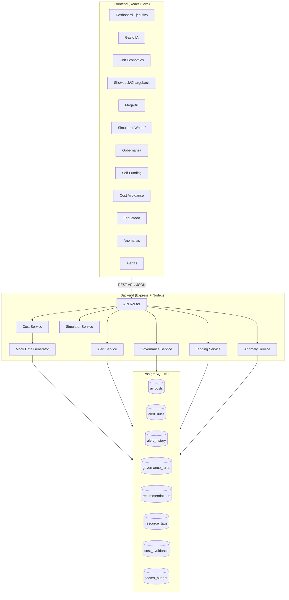
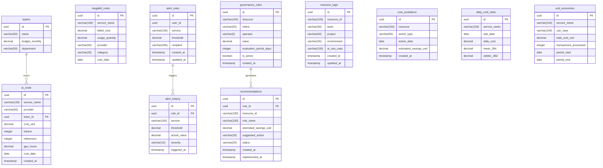

# Design Document: AI Cost Tracker FinOps — Strategy Cockpit

## Overview

El módulo "Strategy Cockpit" es una plataforma FinOps que unifica la visibilidad de costos de IA y nube para la Gerencia de Estrategia Tecnológica de Seguros Bolívar. Su objetivo es pasar de "explicar el gasto pasado" a "influenciar decisiones futuras" mediante gobernanza proactiva, showback por equipo/célula y demostración de ROI.

### Problema de Negocio

La Gerencia de Estrategia Tecnológica carece de una vista consolidada del gasto en IA y cloud que permita:
- Identificar drivers de costo por servicio, equipo y proveedor
- Asignar costos a células de desarrollo (showback)
- Detectar anomalías y recursos ociosos proactivamente
- Justificar la inversión en IA ante CTO/CIO demostrando autofinanciamiento

### Métricas de Impacto Esperado

| Métrica | Valor Esperado |
|---------|---------------|
| Reducción de costos por gobernanza proactiva | 15-25% en recursos ociosos |
| Tiempo de identificación de anomalías | De días a minutos |
| Visibilidad de costos por célula | 100% de células con showback |
| Ratio de self-funding de IA | Meta > 100% |

### Decisiones Arquitectónicas Clave

| Decisión | Justificación |
|----------|---------------|
| React (Vite + Tailwind + Shadcn UI) para frontend | Stack aprobado para interfaces dinámicas de alta performance. Recharts para visualizaciones financieras. |
| Express (Node.js) para backend | Stack aprobado, adecuado para APIs REST con validación Zod y respuesta rápida. |
| PostgreSQL para persistencia | BD relacional estándar institucional, ideal para datos tabulares de costos y métricas. |
| Datos mock para hackathon | Permite demostración funcional sin dependencias externas de cloud billing. |
| Formato FOCUS para normalización | Estándar FinOps para interoperabilidad multi-proveedor. |
| Detección estadística de anomalías (σ) | Método simple y comprobable con datos históricos mock, sin necesidad de ML complejo. |

---

## Architecture

### Diagrama de Arquitectura General



### Capas de la Solución

1. **Presentación (Frontend React):** Dashboards interactivos con Recharts, tablas con Shadcn UI, formularios con React Hook Form + Zod. Sin lógica de negocio.
2. **Lógica (Backend Express):** Servicios de dominio con validación, cálculo de métricas, evaluación de reglas, simulación y detección de anomalías.
3. **Persistencia (PostgreSQL):** Datos mock pre-generados y datos de configuración (alertas, reglas, etiquetas).

### Comunicación entre Capas

- Frontend → Backend: REST API sobre HTTP con JSON. Axios como cliente HTTP.
- Backend → DB: Queries parametrizadas con `pg` (node-postgres). Pool de conexiones.
- Autenticación: JWT simulado para el prototipo (header `Authorization: Bearer <token>`).
- Correlation-ID: Propagado en header `X-Correlation-ID` en cada request.

---

## Components and Interfaces

### Frontend — Estructura de Módulos

```
frontend/src/
├── components/           # Componentes transversales (layout, UI base)
│   ├── ui/              # Shadcn UI components
│   ├── layout/          # Sidebar, Header, PageContainer
│   └── charts/          # Wrappers de Recharts reutilizables
├── features/
│   ├── ai-spend/        # Req 1: Visualización gasto IA
│   ├── unit-economics/  # Req 2: Unit Economics
│   ├── showback/        # Req 3: Showback/Chargeback
│   ├── alerts/          # Req 4: Alertas configurables
│   ├── megabill/        # Req 5: Vista MegaBill
│   ├── simulator/       # Req 6: Simulador What-If
│   ├── governance/      # Req 7: Gobernanza
│   ├── self-funding/    # Req 8: Self-Funding
│   ├── cost-avoidance/  # Req 9: Cost Avoidance
│   ├── executive/       # Req 10: Dashboard Ejecutivo
│   ├── tagging/         # Req 11: Etiquetado
│   └── anomalies/       # Req 12: Anomalías
├── services/            # API clients (Axios)
├── hooks/               # Hooks globales (useAuth, useFilters)
├── types/               # TypeScript interfaces/types
├── config/              # Constantes, env vars
└── lib/                 # Utilidades (formatters, validators)
```

### Backend — Estructura de Módulos

```
backend/src/
├── routes/              # Express routers por dominio
│   ├── cost.routes.js
│   ├── alert.routes.js
│   ├── simulator.routes.js
│   ├── governance.routes.js
│   ├── tagging.routes.js
│   ├── anomaly.routes.js
│   └── executive.routes.js
├── services/            # Lógica de negocio
│   ├── cost.service.js
│   ├── alert.service.js
│   ├── simulator.service.js
│   ├── governance.service.js
│   ├── tagging.service.js
│   └── anomaly.service.js
├── repositories/        # Acceso a datos (pg queries)
├── validators/          # Schemas Zod por dominio
├── middleware/          # Auth, correlation-id, error-handler
├── mock/                # Generador de datos mock
├── config/              # DB config, env vars
└── utils/               # Formatters, helpers
```

### API Endpoints (REST)

| Método | Ruta | Descripción | Req |
|--------|------|-------------|-----|
| GET | `/api/v1/costs/ai-spend` | Gasto IA con filtros | 1 |
| POST | `/api/v1/costs/ai-spend/advance` | Simular avance temporal | 1 |
| GET | `/api/v1/costs/unit-economics` | Unit economics por servicio | 2 |
| GET | `/api/v1/costs/showback` | Showback por célula | 3 |
| GET/POST/PUT/DELETE | `/api/v1/alerts/rules` | CRUD reglas de alerta | 4 |
| GET | `/api/v1/alerts/active` | Alertas activas | 4 |
| GET | `/api/v1/alerts/history` | Historial de alertas | 4 |
| GET | `/api/v1/costs/megabill` | Vista consolidada | 5 |
| GET | `/api/v1/costs/megabill/:category` | Drill-down categoría | 5 |
| POST | `/api/v1/simulator/projection` | Ejecutar simulación what-if | 6 |
| GET/POST/PUT/DELETE | `/api/v1/governance/rules` | CRUD reglas gobernanza | 7 |
| GET | `/api/v1/governance/recommendations` | Recomendaciones activas | 7 |
| PATCH | `/api/v1/governance/recommendations/:id/implement` | Marcar implementada | 7 |
| GET | `/api/v1/self-funding` | Ratio self-funding | 8 |
| GET | `/api/v1/cost-avoidance` | Reporte cost avoidance | 9 |
| POST | `/api/v1/cost-avoidance` | Registrar acción preventiva | 9 |
| GET | `/api/v1/executive/dashboard` | KPIs ejecutivos | 10 |
| GET | `/api/v1/executive/export-pdf` | Exportar PDF | 10 |
| GET/POST/PUT/DELETE | `/api/v1/tagging/resources` | CRUD etiquetas | 11 |
| GET | `/api/v1/tagging/compliance` | % compliance | 11 |
| GET | `/api/v1/anomalies` | Anomalías detectadas | 12 |

### Interfaces Principales (TypeScript)

```typescript
// Filtros comunes
interface CostFilters {
  startDate: string;       // ISO-8601
  endDate: string;         // ISO-8601
  team?: string;
  provider?: 'AWS Bedrock' | 'OpenAI' | 'Anthropic';
}

// Respuesta Gasto IA (Req 1)
interface AISpendResponse {
  totalCost: number;
  breakdown: AISpendItem[];
  filters: CostFilters;
}

interface AISpendItem {
  name: string;
  costUsd: number;
  percentage: number;
  tokens?: number;
  inferences?: number;
  gpuHours?: number;
  groupBy: 'service' | 'team' | 'provider';
}

// Unit Economics (Req 2)
interface UnitEconomicsRow {
  serviceName: string;
  totalCostUsd: number;          // 2 decimales
  transactionsProcessed: number;  // entero >= 0
  unitCostUsd: number | null;    // 4 decimales, null si 0 transacciones
  weeklyTrend: number[];         // últimas 8 semanas
  trendDirection: 'up' | 'down' | 'stable';
}

// Showback (Req 3)
interface ShowbackRow {
  teamName: string;
  cloudCost: number;
  aiCost: number;
  saasCost: number;
  totalCost: number;
  budget: number | null;
  budgetPercentage: number | null;  // 1 decimal
  efficiencyRatio: number | null;   // 2 decimales
}

// Alerta (Req 4)
interface AlertRule {
  id: string;
  service: string;
  threshold: number;       // 0.01 a 999,999,999.99
  recipient: string;       // email, max 255 chars
  createdAt: string;
  updatedAt: string;
}

interface Alert {
  id: string;
  ruleId: string;
  service: string;
  threshold: number;
  actualValue: number;
  severity: 'warning' | 'critical';
  triggeredAt: string;     // ISO-8601
}

// MegaBill FOCUS (Req 5)
interface FOCUSRecord {
  serviceName: string;     // max 100 chars
  billedCost: number;      // 2 decimales
  usageQuantity: number;   // >= 0
  provider: string;
  category: 'cloud' | 'saas' | 'licenses';
}

// Simulador (Req 6)
interface SimulationRequest {
  serviceId: string;
  incrementPercentage: number;  // 1-500 entero
}

interface SimulationResponse {
  projections: {
    month: number;           // 1, 3, 6
    optimistic: number;      // percentil 25
    base: number;            // percentil 50
    pessimistic: number;     // percentil 75
  }[];
  historicalBase: number[];
}

// Gobernanza (Req 7)
interface GovernanceRule {
  id: string;
  resource: string;
  metric: 'cpu' | 'memory' | 'network' | 'disk';
  operator: 'gt' | 'lt' | 'eq' | 'gte' | 'lte';
  value: number;
  evaluationPeriodDays: number;  // 1-90
}

interface Recommendation {
  id: string;
  resourceId: string;
  ruleName: string;
  estimatedSavingsUsd: number;
  suggestedAction: 'resize' | 'delete' | 'reserve';
  status: 'active' | 'implemented';
  implementedAt?: string;
}

// Self-Funding (Req 8)
interface SelfFundingResponse {
  investmentUsd: number;
  savingsUsd: number;
  selfFundingRatio: number;   // 2 decimales
  period: string;
}

// Cost Avoidance (Req 9)
interface CostAvoidanceAction {
  id: string;
  resource: string;            // max 100 chars
  actionType: 'revisión arquitectónica' | 'rightsizing preventivo' | 'eliminación de propuesta';
  date: string;                // ISO-8601
  estimatedSavingsUsd: number; // 0.01 a 999,999,999.99
}

// Anomalía (Req 12)
interface AnomalyAlert {
  id: string;
  serviceName: string;
  currentAmountUsd: number;
  expectedAmountUsd: number;
  standardDeviations: number;  // 1 decimal
  severity: 'warning' | 'critical';
  startDate: string;           // ISO-8601
}
```

---

## Data Models

### Diagrama Entidad-Relación



### Índices de Performance

| Tabla | Índice | Columnas | Propósito |
|-------|--------|----------|-----------|
| `ai_costs` | `idx_ai_costs_date_team` | `cost_date, team_id` | Filtrado rápido por fecha y equipo |
| `ai_costs` | `idx_ai_costs_provider` | `provider, cost_date` | Filtrado por proveedor |
| `megabill_costs` | `idx_megabill_category` | `category, cost_date` | Agrupación por categoría |
| `alert_history` | `idx_alert_history_date` | `triggered_at DESC` | Historial ordenado |
| `recommendations` | `idx_recommendations_status` | `status, estimated_savings_usd DESC` | Ranking por ahorro |
| `daily_cost_stats` | `idx_daily_stats_service` | `service_name, stat_date` | Consulta de anomalías |
| `resource_tags` | `idx_tags_resource` | `resource_id` | Lookup de etiquetas |

### Datos Mock

El generador de datos mock producirá:
- **3 proveedores IA:** AWS Bedrock (Titan, Claude), OpenAI (GPT-4, DALL-E), Anthropic (Claude, Haiku)
- **5 células de desarrollo:** Célula Vida Digital, Célula Auto Express, Célula Siniestros AI, Célula Core Bancario, Célula Atención Cliente
- **3 proveedores cloud:** AWS, Azure, GCP (2+ servicios cada uno)
- **2 SaaS:** Datadog, Confluent
- **2 licencias:** Oracle DB, ServiceNow
- **3 casos de uso negocio:** Cotización de póliza, Análisis de siniestro, Atención al cliente
- **Datos históricos:** 6 meses de costos diarios para soporte de tendencias y anomalías

---


## Correctness Properties

*A property is a characteristic or behavior that should hold true across all valid executions of a system — essentially, a formal statement about what the system should do. Properties serve as the bridge between human-readable specifications and machine-verifiable correctness guarantees.*

### Property 1: Percentage distributions sum to 100%

*For any* non-empty set of cost items grouped by a dimension (service, team, provider, or category), the sum of all percentage values in the response SHALL equal 100.0% (with floating-point tolerance of ±0.1%), and each individual percentage SHALL equal `(itemCost / totalCost) × 100`.

**Validates: Requirements 1.1, 5.5**

### Property 2: Filtering returns only matching records

*For any* dataset of cost records and any valid filter (date range, team, provider, or category), all records in the filtered response SHALL satisfy the filter condition, and no record satisfying the filter condition SHALL be excluded from the response.

**Validates: Requirements 1.2, 1.3, 1.4, 5.2, 9.5**

### Property 3: Sorted outputs preserve correct ordering

*For any* collection to be sorted (alerts by severity+date, recommendations by savings, cost avoidance by date, efficiency ranking by ratio), the output list SHALL be in the specified order such that for any adjacent pair (a, b), the ordering predicate `a ≤ b` holds.

**Validates: Requirements 3.3, 4.5, 7.4, 9.3**

### Property 4: Input validation accepts valid inputs and rejects invalid inputs

*For any* input to a CRUD operation (alert rules, governance rules, cost avoidance actions, resource tags, simulation parameters), if all fields satisfy their defined constraints (type, range, format, length), the operation SHALL succeed; if any field violates a constraint, the operation SHALL be rejected with an error indicating the invalid fields, without modifying existing data.

**Validates: Requirements 4.1, 4.2, 4.3, 6.4, 7.1, 9.1, 11.1, 11.2**

### Property 5: Aggregated totals equal sum of components

*For any* set of records contributing to a total (showback total = cloud + AI + SaaS per team; total estimated savings = sum of active recommendations; monthly cost avoidance = sum of actions in month), the reported total SHALL exactly equal the arithmetic sum of its constituent parts.

**Validates: Requirements 3.1, 7.5, 9.2**

### Property 6: Unit cost calculation correctness

*For any* service with `totalCost > 0` and `transactionsProcessed > 0`, the unit cost SHALL equal `totalCost / transactionsProcessed` rounded to 4 decimal places. When `transactionsProcessed = 0`, the unit cost SHALL be null ("N/A").

**Validates: Requirements 2.1, 2.5**

### Property 7: Budget percentage calculation correctness

*For any* team with a non-null, non-zero budget, the budget percentage SHALL equal `(totalCost / budget) × 100` rounded to 1 decimal place. Teams without budget SHALL display "Sin presupuesto" and be excluded from the efficiency ranking.

**Validates: Requirements 3.2, 3.5**

### Property 8: Self-funding ratio calculation

*For any* period where `investmentTotal > 0`, the self-funding ratio SHALL equal `(savingsTotal / investmentTotal) × 100` rounded to 2 decimal places. When `investmentTotal = 0`, the ratio SHALL be 0%.

**Validates: Requirements 8.2, 8.3**

### Property 9: Projection scenarios maintain ordering invariant

*For any* what-if simulation result at any time horizon (1, 3, or 6 months), the projected costs SHALL satisfy: `optimistic ≤ base ≤ pessimistic`, corresponding to percentiles 25, 50, and 75 of the historical cost distribution.

**Validates: Requirements 6.1, 6.2**

### Property 10: Alert severity correctly assigned at threshold levels

*For any* service with an alert rule of threshold T and current spend S: if `S ≥ T` then severity SHALL be "critical"; if `S ≥ 0.8 × T` and `S < T` then severity SHALL be "warning"; if `S < 0.8 × T` then no alert SHALL be generated. No duplicate alerts SHALL exist for the same service, threshold, and evaluation period.

**Validates: Requirements 4.4**

### Property 11: Anomaly detection classification by standard deviations

*For any* service with at least 28 days of historical data, given mean μ and standard deviation σ of daily costs, if today's cost C satisfies `C > μ + 3σ` then severity SHALL be "critical"; if `C > μ + 2σ` and `C ≤ μ + 3σ` then severity SHALL be "warning"; if `C ≤ μ + 2σ` then no anomaly SHALL be generated. Services with fewer than 28 days of data SHALL be excluded.

**Validates: Requirements 12.1, 12.2, 12.4, 12.5**

### Property 12: Trend direction correctly reflects cost change

*For any* service with consecutive weekly unit costs (previous, current): if `current > previous` then direction SHALL be "up"; if `current < previous` then direction SHALL be "down"; if `current = previous` then direction SHALL be "stable".

**Validates: Requirements 2.4**

### Property 13: Budget exceeded flag set correctly

*For any* team whose budget percentage exceeds 100%, the `overBudget` flag SHALL be true and the row SHALL be visually highlighted. For teams at or below 100%, the flag SHALL be false.

**Validates: Requirements 3.4**

### Property 14: Tagging compliance correctly calculated and alerted

*For any* set of resources, the compliance percentage SHALL equal `(resources with all 4 mandatory fields complete / total resources) × 100`. When this percentage falls below 80%, a warning alert SHALL be generated with the current percentage to 1 decimal precision.

**Validates: Requirements 11.3, 11.4**

### Property 15: Governance rule evaluation generates recommendation only for sustained violations

*For any* resource and governance rule, a rightsizing recommendation SHALL be generated only if the resource's metric violates the rule condition for the entire evaluation period (consecutive days). Partial violations SHALL NOT generate recommendations.

**Validates: Requirements 7.3**

### Property 16: Implementing a recommendation excludes it from active calculations

*For any* recommendation marked as implemented, it SHALL be moved to history with implementation date, excluded from the active recommendations list, and excluded from the total active savings calculation. The total active savings after implementation SHALL equal the previous total minus the implemented recommendation's savings.

**Validates: Requirements 7.6**

### Property 17: KPI variation flag for unfavorable cost changes

*For any* KPI comparing current month vs. previous month spend, if the percentage variation `((current - previous) / previous) × 100` exceeds 15%, the KPI SHALL be flagged for red highlighting. Otherwise, no flag SHALL be set.

**Validates: Requirements 10.4**

---

## Error Handling

### Frontend Error Handling Strategy

| Escenario | Comportamiento | UX |
|-----------|---------------|-----|
| API timeout (> 5s) | Mostrar mensaje de error + botón reintentar | Toast de error (Sonner) + estado de error en el componente |
| API HTTP 4xx | Mostrar mensaje descriptivo según código | Toast warning con detalle |
| API HTTP 5xx | Mensaje genérico "Error interno" + reintentar | Toast error + fallback a estado vacío |
| Sin datos para filtros | Mostrar estado vacío con mensaje informativo | Componente EmptyState con icono y texto |
| Validación de formulario | Mostrar errores inline por campo | React Hook Form + Zod con mensajes en español |
| Exportación PDF fallida | Toast de error + sugerir reintentar | Sonner toast con acción |

### Backend Error Handling Strategy

```typescript
// Estructura estándar de error
interface APIError {
  statusCode: number;
  error: string;
  message: string;
  details?: { field: string; reason: string }[];
  correlationId: string;
}
```

| Código HTTP | Caso de Uso | Detalle |
|-------------|-------------|---------|
| 400 | Validación fallida | `details` con campos inválidos y razón |
| 401 | Token JWT inválido/ausente | Mensaje genérico sin detalles de auth |
| 404 | Recurso no encontrado | ID del recurso solicitado |
| 409 | Conflicto (duplicado, límite) | Descripción del conflicto |
| 422 | Datos insuficientes (< 3 meses para simulador) | Razón específica |
| 429 | Rate limit excedido | Header `Retry-After` |
| 500 | Error interno inesperado | Mensaje genérico, detalles solo en logs |

### Principios de Error Handling

1. **Fail Fast:** Validar inputs en la primera capa (middleware Zod). Rechazar temprano.
2. **Errores genéricos al cliente:** Nunca exponer stack traces, queries SQL, o detalles internos.
3. **Logging estructurado:** Cada error se loguea con `correlationId`, timestamp, servicio afectado y detalle técnico.
4. **Idempotencia:** Operaciones de escritura deben ser seguras ante reintentos (verificar existencia antes de crear).
5. **Estado consistente:** Las operaciones de validación fallida nunca modifican datos (transacción rollback automático).
6. **Circuit Breaker:** Si la base de datos no responde en 3 intentos, retornar 503 con `Retry-After`.

---

## Testing Strategy

### Enfoque Dual: Unit Tests + Property-Based Tests

Este feature es altamente adecuado para property-based testing porque contiene:
- Cálculos matemáticos universales (porcentajes, ratios, promedios, desviaciones estándar)
- Lógica de filtrado que debe funcionar para cualquier combinación de datos
- Reglas de validación con rangos definidos
- Lógica de clasificación (severidades, tendencias) que depende del input
- Invariantes de ordenamiento

### Framework de Testing

| Capa | Framework | Librería PBT |
|------|-----------|--------------|
| Backend (Node.js) | Jest + Supertest | fast-check |
| Frontend (React) | Vitest + React Testing Library | fast-check |

### Property-Based Testing Configuration

- **Librería:** [fast-check](https://github.com/dubzzz/fast-check) — librería PBT madura para JavaScript/TypeScript
- **Iteraciones mínimas:** 100 por propiedad
- **Tag format:** `Feature: ai-cost-tracker-finops, Property {N}: {description}`
- Cada propiedad del documento se implementa como UN test property-based

### Estructura de Tests

```
backend/
├── tests/
│   ├── unit/
│   │   ├── cost.service.test.js
│   │   ├── alert.service.test.js
│   │   ├── simulator.service.test.js
│   │   ├── governance.service.test.js
│   │   ├── anomaly.service.test.js
│   │   └── tagging.service.test.js
│   ├── properties/
│   │   ├── percentage-distribution.property.test.js
│   │   ├── filtering.property.test.js
│   │   ├── sorting.property.test.js
│   │   ├── validation.property.test.js
│   │   ├── aggregation.property.test.js
│   │   ├── calculations.property.test.js
│   │   ├── simulator.property.test.js
│   │   ├── alerts.property.test.js
│   │   ├── anomalies.property.test.js
│   │   └── governance.property.test.js
│   ├── integration/
│   │   ├── cost.routes.test.js
│   │   ├── alert.routes.test.js
│   │   └── ...
│   └── mocks/
│       ├── cost-data.mock.js
│       └── db.mock.js

frontend/
├── src/
│   ├── features/
│   │   ├── ai-spend/
│   │   │   └── __tests__/
│   │   ├── unit-economics/
│   │   │   └── __tests__/
│   │   └── ...
│   └── lib/
│       └── __tests__/
│           ├── formatters.property.test.ts
│           └── calculators.property.test.ts
```

### Cobertura Esperada

| Capa | Meta de Cobertura | Tipo de Tests |
|------|-------------------|---------------|
| Servicios backend (lógica) | > 80% | Unit + Property |
| Validators backend | > 95% | Property (generación exhaustiva de inputs) |
| Rutas backend | > 80% | Integration (Supertest) |
| Utilidades frontend (cálculos) | > 90% | Property |
| Componentes frontend | > 70% | Unit (React Testing Library) |

### Unit Tests — Enfoque

Los unit tests cubren:
- **Ejemplos específicos:** Casos representativos con valores concretos
- **Edge cases:** División por cero, arrays vacíos, servicios sin datos históricos
- **Integración de componentes:** Interacción entre servicio y repositorio (mocks)
- **Error handling:** Validar que cada tipo de error produce la respuesta correcta

### Property Tests — Enfoque

Los property tests cubren las 17 correctness properties con:
- Generadores de datos arbitrarios (costos, fechas, equipos, reglas)
- Mínimo 100 iteraciones por test
- Shrinking automático para encontrar el caso mínimo de fallo
- Tags de referencia al documento de diseño

### Mocks y Fixtures

- **Base de datos:** Mock de `pg` pool con respuestas predefinidas
- **Datos de costos:** Generador parametrizable de registros mock
- **JWT:** Token mock válido para tests de integración
- **No se permiten** conexiones reales a BD ni APIs externas en tests

