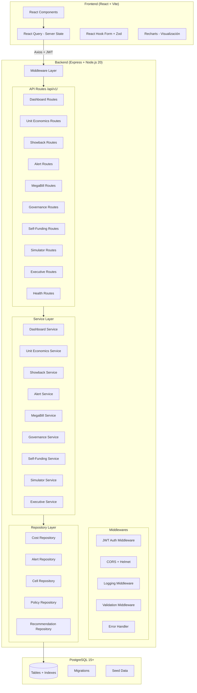
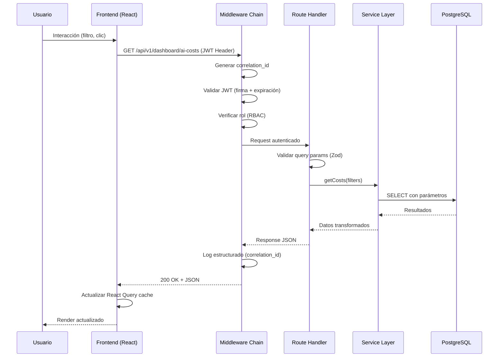
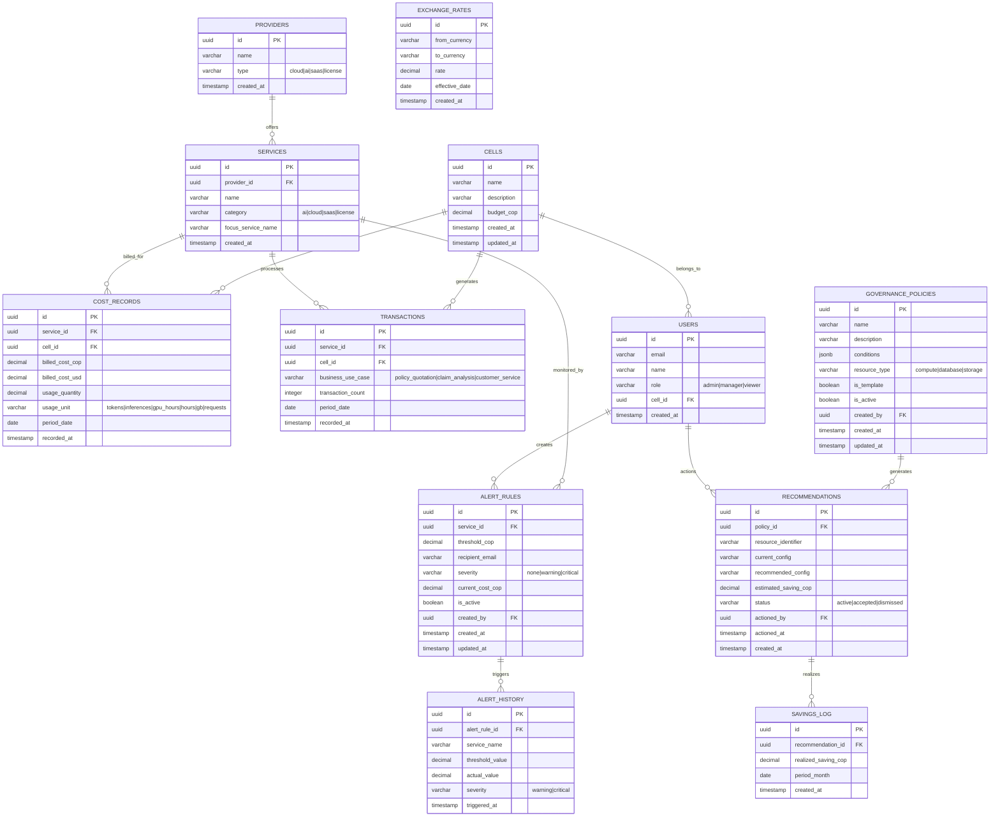

# Design Document: AI Cost Tracker & FinOps Governance Engine

## Overview

El AI Cost Tracker & FinOps Governance Engine es un módulo del Strategy Cockpit de Seguros Bolívar que proporciona visibilidad unificada de costos AI y cloud, governance proactiva, showback por célula de desarrollo y demostración del ROI de inversión tecnológica.

### Decisiones de Stack Tecnológico

| Capa | Tecnología | Justificación |
|------|-----------|---------------|
| Frontend | React 18 + Vite 5.x + TypeScript 5.x | Interfaces dinámicas con gráficos interactivos (Recharts), ideal para dashboards financieros |
| Backend | Node.js 20 LTS + Express 4.x | Alineado con perfil Standard de autogestión, soporte institucional completo |
| Base de Datos | PostgreSQL 15+ | Estándar corporativo con soporte DBA institucional |
| Validación | Zod 3.x (frontend/backend) | Validación TypeScript-first compartida |
| ORM/DB Client | pg (node-postgres) 8.x | Cliente aprobado para PostgreSQL en Node.js |
| Migraciones | node-pg-migrate | Herramienta aprobada para migraciones PostgreSQL |
| Autenticación | Passport.js + JWT (jsonwebtoken 9.x) | Estándar institucional para APIs RESTful |
| Testing | Jest 30.x + Supertest 7.x (backend), Vitest 3.x + RTL 16.x (frontend) | Frameworks aprobados por stack |
| Containerización | Docker 24.x + Docker Compose | Despliegues reproducibles multi-servicio |

### Objetivos del Diseño

1. **Visibilidad Unificada**: Consolidar costos AI, cloud y SaaS en una vista normalizada FOCUS
2. **Governance Proactiva**: Motor de reglas que detecta ineficiencias y recomienda optimizaciones
3. **Showback por Célula**: Asignación transparente de costos a cada equipo de desarrollo
4. **Demostración de ROI**: Comparar inversión AI vs. savings para probar autofinanciamiento
5. **Proyección Predictiva**: Simulador what-if con bandas de confianza para planificación presupuestaria

### Priorización de Historias — Camino de Oro (Demo)

El sistema se divide en dos tiers de prioridad para efectos del demo y la implementación incremental:

| Tier | Historias | Criterio |
|------|-----------|----------|
| **🥇 Golden Path (must-work)** | HUF01 (AI Dashboard), HUF02 (Unit Economics), HUF03 (Showback), HUF04 (Alertas), HUF08 (Self-Funding Ratio) | Forman el flujo crítico del demo. Si alguna de estas falla, el demo no se puede realizar. Deben estar 100% funcionales y testeadas antes de la presentación. |
| **🥈 Secundarias (should-work)** | HUF05 (MegaBill), HUF06 (Simulador What-If), HUF07 (Governance Engine), HUF10 (Executive Dashboard) | Deben existir y funcionar correctamente, pero NO bloquean el demo si presentan problemas menores. Se implementan después del golden path. |

**Reglas de implementación por tier:**

1. **Golden Path primero**: Todas las tareas de implementación del golden path se ejecutan antes de comenzar las historias secundarias.
2. **Testing exhaustivo en Golden Path**: Las historias del golden path requieren 100% de sus property-based tests pasando antes de marcarlas como completadas.
3. **Secundarias con fallback**: Las historias secundarias pueden mostrar un empty state o mensaje "disponible próximamente" si no están listas para el demo, sin romper la navegación.
4. **Integración completa en Golden Path**: El endpoint `/api/v1/finops/summary` (RT-10) se alimenta exclusivamente de datos del golden path (KPI principal, trend y alertas).

---

## Architecture

### Diagrama de Arquitectura de Alto Nivel



### Diagrama de Secuencia: Flujo de Request Típico



### Principios Arquitectónicos Aplicados

1. **Separación por capas**: Presentación → Lógica → Persistencia (nunca lógica de negocio en frontend)
2. **Security by Design**: JWT + RBAC + validación en servidor + queries parametrizadas
3. **API First**: OpenAPI 3.0 como contrato, versionado con `/api/v1/`
4. **Observabilidad**: Correlation-ID en cada request, logs JSON estructurados
5. **Resiliencia**: Circuit breakers conceptuales para futuras integraciones externas
6. **Graceful Shutdown**: Completar transacciones en curso antes de apagar

---

## Components and Interfaces

### Frontend Components

```
src/
├── components/          # Componentes UI reutilizables
│   ├── ui/             # Shadcn UI components (Button, Card, Input, etc.)
│   ├── charts/         # Wrappers de Recharts reutilizables
│   │   ├── SparklineChart.tsx
│   │   ├── LineChart.tsx
│   │   ├── BarChart.tsx
│   │   └── DualAxisChart.tsx
│   ├── layout/         # Shell, Sidebar, Header
│   └── common/         # EmptyState, LoadingSpinner, CurrencyDisplay
├── features/
│   ├── ai-dashboard/       # HUF01 - AI Cost Dashboard
│   │   ├── components/
│   │   ├── hooks/
│   │   └── services/
│   ├── unit-economics/     # HUF02 - Unit Economics
│   ├── showback/           # HUF03 - Showback per Cell
│   ├── alerts/             # HUF04 - Threshold Alerts
│   ├── megabill/           # HUF05 - MegaBill
│   ├── governance/         # HUF07 - Governance Engine
│   ├── self-funding/       # HUF08 - Self-Funding
│   ├── simulator/          # HUF06 - What-If Simulator
│   └── executive/          # HUF10 - Executive Dashboard
├── services/           # API clients globales (Axios instance)
├── hooks/              # Hooks globales (useAuth, useCurrency)
├── types/              # Interfaces TypeScript compartidas
├── config/             # Variables de entorno, constantes
└── lib/                # Utilidades (formatCOP, formatUSD, cn)
```

### Backend Components

```
backend/
├── src/
│   ├── config/
│   │   ├── database.js         # Pool PostgreSQL (pg)
│   │   ├── environment.js      # Validación de env vars con Zod
│   │   └── swagger.js          # OpenAPI/Swagger setup
│   ├── middleware/
│   │   ├── auth.js             # JWT validation + role extraction
│   │   ├── rbac.js             # Role-based access control
│   │   ├── correlation-id.js   # UUID generation per request
│   │   ├── logger.js           # Structured JSON logging
│   │   ├── error-handler.js    # Global error handler
│   │   └── validator.js        # Zod schema validation
│   ├── features/
│   │   ├── dashboard/
│   │   │   ├── dashboard.routes.js
│   │   │   ├── dashboard.controller.js
│   │   │   ├── dashboard.service.js
│   │   │   ├── dashboard.repository.js
│   │   │   └── dashboard.schemas.js
│   │   ├── unit-economics/
│   │   ├── showback/
│   │   ├── alerts/
│   │   ├── megabill/
│   │   ├── governance/
│   │   ├── self-funding/
│   │   ├── simulator/
│   │   ├── executive/
│   │   └── health/
│   ├── shared/
│   │   ├── errors/             # Custom error classes
│   │   ├── utils/              # Currency conversion, date helpers
│   │   └── constants/          # Enums, magic numbers
│   ├── app.js                  # Express app setup
│   └── server.js               # Server start + graceful shutdown
├── migrations/                 # node-pg-migrate files
├── seeds/                      # Seed data scripts
└── tests/                      # Jest + Supertest tests
```

### API Interfaces (OpenAPI 3.0)

| Endpoint | Method | Descripción | Roles |
|----------|--------|-------------|-------|
| `/api/v1/dashboard/ai-costs` | GET | Costos AI agrupados por servicio/equipo/proveedor | viewer, manager, admin |
| `/api/v1/dashboard/ai-costs/metrics` | GET | Métricas: tokens, inferencias, GPU hours | viewer, manager, admin |
| `/api/v1/unit-economics` | GET | Tabla de costo por transacción | viewer, manager, admin |
| `/api/v1/unit-economics/trends` | GET | Sparklines semanales (8 semanas) | viewer, manager, admin |
| `/api/v1/showback/cells` | GET | Vista showback por célula | viewer, manager, admin |
| `/api/v1/showback/cells/:cellId` | GET | Desglose por servicio de una célula | viewer, manager, admin |
| `/api/v1/showback/ranking` | GET | Ranking de eficiencia por célula | viewer, manager, admin |
| `/api/v1/alerts` | GET | Listar alertas activas | viewer, manager, admin |
| `/api/v1/alerts` | POST | Crear regla de alerta | manager, admin |
| `/api/v1/alerts/:id` | PUT | Actualizar regla de alerta | manager, admin |
| `/api/v1/alerts/:id` | DELETE | Eliminar regla de alerta | admin |
| `/api/v1/alerts/history` | GET | Historial de alertas disparadas | viewer, manager, admin |
| `/api/v1/megabill` | GET | Vista consolidada MegaBill | viewer, manager, admin |
| `/api/v1/megabill/drilldown/:category` | GET | Drill-down por categoría | viewer, manager, admin |
| `/api/v1/megabill/services/:serviceId/trend` | GET | Tendencia mensual de servicio (6 meses) | viewer, manager, admin |
| `/api/v1/governance/policies` | GET | Listar políticas de governance | viewer, manager, admin |
| `/api/v1/governance/policies` | POST | Crear política | manager, admin |
| `/api/v1/governance/policies/:id` | PUT | Actualizar política | manager, admin |
| `/api/v1/governance/policies/:id` | DELETE | Eliminar política | admin |
| `/api/v1/governance/recommendations` | GET | Listar recomendaciones activas | viewer, manager, admin |
| `/api/v1/governance/recommendations/:id/accept` | PATCH | Aceptar recomendación | manager, admin |
| `/api/v1/governance/recommendations/:id/dismiss` | PATCH | Descartar recomendación | manager, admin |
| `/api/v1/self-funding` | GET | Dashboard AI investment vs savings | viewer, manager, admin |
| `/api/v1/self-funding/timeline` | GET | Evolución mensual (12 meses) | viewer, manager, admin |
| `/api/v1/simulator/project` | POST | Calcular proyección what-if | viewer, manager, admin |
| `/api/v1/executive/summary` | GET | Dashboard ejecutivo one-pager | viewer, manager, admin |
| `/api/v1/finops/summary` | GET | Endpoint de integración con Strategy Cockpit (contrato RT-10) | viewer, manager, admin |
| `/api/v1/docs` | GET | Swagger UI | — (público) |
| `/health` | GET | Health check (DB connectivity) | — (público) |

### Request/Response Schemas (Ejemplos Clave)

**GET /api/v1/dashboard/ai-costs**

Query params: `?startDate=2025-01-01&endDate=2025-06-30&cellId=uuid&providerId=uuid`

```json
{
  "totalCop": 245000000,
  "totalUsd": 58200,
  "byService": [
    { "serviceName": "Claude 3.5 Sonnet", "costCop": 120000000, "costUsd": 28500 }
  ],
  "byTeam": [
    { "cellName": "Célula Datos", "costCop": 95000000, "costUsd": 22600 }
  ],
  "byProvider": [
    { "providerName": "AWS Bedrock", "costCop": 150000000, "costUsd": 35700 }
  ],
  "lastUpdated": "2025-07-15T14:00:00.000Z"
}
```

**POST /api/v1/alerts**

Request:
```json
{
  "serviceId": "uuid",
  "thresholdCop": 50000000,
  "recipientEmail": "finops-lead@segurosbolivar.com"
}
```

Response (201):
```json
{
  "id": "uuid",
  "serviceId": "uuid",
  "serviceName": "GPT-4o",
  "thresholdCop": 50000000,
  "recipientEmail": "finops-lead@segurosbolivar.com",
  "severity": "none",
  "currentCostCop": 0,
  "isActive": true,
  "createdAt": "2025-07-15T14:30:00.000Z"
}
```

**GET /api/v1/finops/summary — Contrato de Integración Strategy Cockpit (RT-10)**

Este endpoint es el contrato de integración obligatorio con el Strategy Cockpit unificado. Los otros 3 módulos del cockpit consumen este schema exacto. **No se debe modificar la estructura sin coordinación con los equipos de los otros módulos.**

Response (200):
```json
{
  "status": "healthy",
  "kpi_principal": {
    "label": "Self-Funding Ratio",
    "value": 73.5,
    "unit": "%"
  },
  "trend": "up",
  "alerts_count": 2
}
```

Schema estricto:

| Campo | Tipo | Valores permitidos | Descripción |
|-------|------|-------------------|-------------|
| `status` | string | `"healthy"` \| `"warning"` \| `"critical"` | Estado general del módulo FinOps. `healthy` = sin alertas críticas activas, `warning` = al menos una alerta warning activa, `critical` = al menos una alerta critical activa |
| `kpi_principal` | object | — | KPI más relevante del módulo para el cockpit unificado |
| `kpi_principal.label` | string | cualquier string descriptivo | Nombre del KPI (e.g., "Self-Funding Ratio", "Total AI Spend") |
| `kpi_principal.value` | number | cualquier número | Valor numérico del KPI |
| `kpi_principal.unit` | string | `"COP"` \| `"%"` | Unidad del valor |
| `trend` | string | `"up"` \| `"down"` \| `"stable"` | Tendencia del KPI principal vs. período anterior |
| `alerts_count` | number | entero >= 0 | Cantidad de alertas críticas activas |

Reglas de cálculo:
- `status`: se determina por la alerta de mayor severidad activa. Si hay al menos una `critical` → `"critical"`. Si hay al menos una `warning` y ninguna `critical` → `"warning"`. Si no hay alertas activas → `"healthy"`.
- `kpi_principal`: por defecto muestra el Self-Funding Ratio (savings / AI investment × 100). Si no hay datos de savings, muestra el total AI spend del mes en COP.
- `trend`: compara el valor del `kpi_principal` del mes actual vs. el mes anterior.
- `alerts_count`: cuenta solo alertas con severity `"critical"`.

**POST /api/v1/simulator/project**

Request:
```json
{
  "serviceIncrements": [
    { "serviceId": "uuid", "percentIncrement": 30 }
  ]
}
```

Response:
```json
{
  "intervals": [
    {
      "months": 1,
      "optimistic": { "totalCop": 52000000, "totalUsd": 12380 },
      "base": { "totalCop": 56000000, "totalUsd": 13330 },
      "pessimistic": { "totalCop": 62000000, "totalUsd": 14760 }
    },
    { "months": 3, "..." : "..." },
    { "months": 6, "..." : "..." }
  ]
}
```

### Interfaces de Servicio (Contratos Internos)

```typescript
// Dashboard Service
interface DashboardService {
  getAICosts(filters: CostFilters): Promise<AICostSummary>;
  getConsumptionMetrics(filters: CostFilters): Promise<ConsumptionMetrics>;
}

// Unit Economics Service
interface UnitEconomicsService {
  getUnitCosts(filters: PeriodFilter): Promise<UnitCostRow[]>;
  getWeeklyTrends(weeks: number): Promise<WeeklyTrend[]>;
}

// Showback Service
interface ShowbackService {
  getCellCosts(filters: PeriodFilter): Promise<CellCostView[]>;
  getCellDetail(cellId: string): Promise<CellServiceBreakdown>;
  getEfficiencyRanking(): Promise<CellRanking[]>;
}

// Alert Service
interface AlertService {
  listAlerts(): Promise<AlertRule[]>;
  createAlert(data: CreateAlertInput): Promise<AlertRule>;
  updateAlert(id: string, data: UpdateAlertInput): Promise<AlertRule>;
  deleteAlert(id: string): Promise<void>;
  getAlertHistory(filters: PeriodFilter): Promise<AlertHistoryEntry[]>;
  evaluateAlerts(): Promise<void>;
}

// MegaBill Service
interface MegaBillService {
  getConsolidatedView(): Promise<MegaBillSummary>;
  drillDown(category: string): Promise<ServiceDetail[]>;
  getServiceTrend(serviceId: string, months: number): Promise<MonthlyTrend[]>;
}

// Governance Service
interface GovernanceService {
  listPolicies(): Promise<GovernancePolicy[]>;
  createPolicy(data: CreatePolicyInput): Promise<GovernancePolicy>;
  listRecommendations(filters?: RecommendationFilter): Promise<Recommendation[]>;
  acceptRecommendation(id: string): Promise<Recommendation>;
  dismissRecommendation(id: string): Promise<Recommendation>;
  getTotalSavings(): Promise<SavingsSummary>;
}

// Self-Funding Service
interface SelfFundingService {
  getSelfFundingDashboard(): Promise<SelfFundingView>;
  getMonthlyEvolution(months: number): Promise<MonthlyEvolution[]>;
}

// Simulator Service
interface SimulatorService {
  project(input: SimulatorInput): Promise<ProjectionResult>;
}

// Executive Service
interface ExecutiveService {
  getExecutiveSummary(): Promise<ExecutiveSummary>;
}
```

---

## Data Models

### Diagrama Entidad-Relación



### PostgreSQL Schema (Migración Principal)

```sql
-- Migration: 001_create_finops_schema.sql

CREATE EXTENSION IF NOT EXISTS "uuid-ossp";

CREATE TABLE cells (
    id UUID PRIMARY KEY DEFAULT uuid_generate_v4(),
    name VARCHAR(100) NOT NULL UNIQUE,
    description TEXT,
    budget_cop DECIMAL(15, 2) NOT NULL DEFAULT 0,
    created_at TIMESTAMPTZ NOT NULL DEFAULT NOW(),
    updated_at TIMESTAMPTZ NOT NULL DEFAULT NOW()
);

CREATE TABLE providers (
    id UUID PRIMARY KEY DEFAULT uuid_generate_v4(),
    name VARCHAR(100) NOT NULL UNIQUE,
    type VARCHAR(20) NOT NULL CHECK (type IN ('cloud', 'ai', 'saas', 'license')),
    created_at TIMESTAMPTZ NOT NULL DEFAULT NOW()
);

CREATE TABLE services (
    id UUID PRIMARY KEY DEFAULT uuid_generate_v4(),
    provider_id UUID NOT NULL REFERENCES providers(id),
    name VARCHAR(150) NOT NULL,
    category VARCHAR(20) NOT NULL CHECK (category IN ('ai', 'cloud', 'saas', 'license')),
    focus_service_name VARCHAR(150) NOT NULL,
    created_at TIMESTAMPTZ NOT NULL DEFAULT NOW(),
    UNIQUE(provider_id, name)
);

CREATE TABLE cost_records (
    id UUID PRIMARY KEY DEFAULT uuid_generate_v4(),
    service_id UUID NOT NULL REFERENCES services(id),
    cell_id UUID NOT NULL REFERENCES cells(id),
    billed_cost_cop DECIMAL(15, 2) NOT NULL,
    billed_cost_usd DECIMAL(15, 2) NOT NULL,
    usage_quantity DECIMAL(15, 4) NOT NULL DEFAULT 0,
    usage_unit VARCHAR(20) NOT NULL CHECK (usage_unit IN ('tokens', 'inferences', 'gpu_hours', 'hours', 'gb', 'requests')),
    period_date DATE NOT NULL,
    recorded_at TIMESTAMPTZ NOT NULL DEFAULT NOW()
);

CREATE TABLE transactions (
    id UUID PRIMARY KEY DEFAULT uuid_generate_v4(),
    service_id UUID NOT NULL REFERENCES services(id),
    cell_id UUID NOT NULL REFERENCES cells(id),
    business_use_case VARCHAR(30) NOT NULL CHECK (business_use_case IN ('policy_quotation', 'claim_analysis', 'customer_service')),
    transaction_count INTEGER NOT NULL DEFAULT 0,
    period_date DATE NOT NULL,
    recorded_at TIMESTAMPTZ NOT NULL DEFAULT NOW()
);

CREATE TABLE alert_rules (
    id UUID PRIMARY KEY DEFAULT uuid_generate_v4(),
    service_id UUID NOT NULL REFERENCES services(id),
    threshold_cop DECIMAL(15, 2) NOT NULL CHECK (threshold_cop > 0),
    recipient_email VARCHAR(255) NOT NULL,
    severity VARCHAR(10) NOT NULL DEFAULT 'none' CHECK (severity IN ('none', 'warning', 'critical')),
    current_cost_cop DECIMAL(15, 2) NOT NULL DEFAULT 0,
    is_active BOOLEAN NOT NULL DEFAULT true,
    created_by UUID REFERENCES users(id),
    created_at TIMESTAMPTZ NOT NULL DEFAULT NOW(),
    updated_at TIMESTAMPTZ NOT NULL DEFAULT NOW()
);

CREATE TABLE alert_history (
    id UUID PRIMARY KEY DEFAULT uuid_generate_v4(),
    alert_rule_id UUID NOT NULL REFERENCES alert_rules(id),
    service_name VARCHAR(150) NOT NULL,
    threshold_value DECIMAL(15, 2) NOT NULL,
    actual_value DECIMAL(15, 2) NOT NULL,
    severity VARCHAR(10) NOT NULL CHECK (severity IN ('warning', 'critical')),
    triggered_at TIMESTAMPTZ NOT NULL DEFAULT NOW()
);

CREATE TABLE governance_policies (
    id UUID PRIMARY KEY DEFAULT uuid_generate_v4(),
    name VARCHAR(150) NOT NULL,
    description TEXT,
    conditions JSONB NOT NULL DEFAULT '{}',
    resource_type VARCHAR(20) NOT NULL CHECK (resource_type IN ('compute', 'database', 'storage')),
    is_template BOOLEAN NOT NULL DEFAULT false,
    is_active BOOLEAN NOT NULL DEFAULT true,
    created_by UUID REFERENCES users(id),
    created_at TIMESTAMPTZ NOT NULL DEFAULT NOW(),
    updated_at TIMESTAMPTZ NOT NULL DEFAULT NOW()
);

CREATE TABLE recommendations (
    id UUID PRIMARY KEY DEFAULT uuid_generate_v4(),
    policy_id UUID NOT NULL REFERENCES governance_policies(id),
    resource_identifier VARCHAR(200) NOT NULL,
    current_config VARCHAR(200) NOT NULL,
    recommended_config VARCHAR(200) NOT NULL,
    estimated_saving_cop DECIMAL(15, 2) NOT NULL,
    status VARCHAR(15) NOT NULL DEFAULT 'active' CHECK (status IN ('active', 'accepted', 'dismissed')),
    actioned_by UUID REFERENCES users(id),
    actioned_at TIMESTAMPTZ,
    created_at TIMESTAMPTZ NOT NULL DEFAULT NOW()
);

CREATE TABLE savings_log (
    id UUID PRIMARY KEY DEFAULT uuid_generate_v4(),
    recommendation_id UUID NOT NULL REFERENCES recommendations(id),
    realized_saving_cop DECIMAL(15, 2) NOT NULL,
    period_month DATE NOT NULL,
    created_at TIMESTAMPTZ NOT NULL DEFAULT NOW()
);

CREATE TABLE exchange_rates (
    id UUID PRIMARY KEY DEFAULT uuid_generate_v4(),
    from_currency VARCHAR(3) NOT NULL DEFAULT 'USD',
    to_currency VARCHAR(3) NOT NULL DEFAULT 'COP',
    rate DECIMAL(10, 4) NOT NULL,
    effective_date DATE NOT NULL,
    created_at TIMESTAMPTZ NOT NULL DEFAULT NOW(),
    UNIQUE(from_currency, to_currency, effective_date)
);

CREATE TABLE users (
    id UUID PRIMARY KEY DEFAULT uuid_generate_v4(),
    email VARCHAR(255) NOT NULL UNIQUE,
    name VARCHAR(150) NOT NULL,
    role VARCHAR(10) NOT NULL CHECK (role IN ('admin', 'manager', 'viewer')),
    cell_id UUID REFERENCES cells(id),
    created_at TIMESTAMPTZ NOT NULL DEFAULT NOW()
);
```

### Índices de Base de Datos

```sql
-- Performance indexes
CREATE INDEX idx_cost_records_period_cell ON cost_records(period_date, cell_id);
CREATE INDEX idx_cost_records_service_period ON cost_records(service_id, period_date);
CREATE INDEX idx_transactions_period_service ON transactions(period_date, service_id);
CREATE INDEX idx_transactions_use_case ON transactions(business_use_case, period_date);
CREATE UNIQUE INDEX idx_alert_rules_service_active ON alert_rules(service_id) WHERE is_active = true;
CREATE INDEX idx_recommendations_status ON recommendations(status, policy_id);
CREATE INDEX idx_savings_period ON savings_log(period_month);
CREATE INDEX idx_alert_history_triggered ON alert_history(triggered_at DESC);
CREATE INDEX idx_cost_records_category ON cost_records(service_id, period_date) INCLUDE (billed_cost_cop, billed_cost_usd);
```

### Modelos TypeScript (Tipos Compartidos)

```typescript
// === Core Domain Types ===

interface Cell {
  id: string;
  name: string;
  description: string;
  budgetCop: number;
  createdAt: string;
  updatedAt: string;
}

interface Provider {
  id: string;
  name: string;
  type: "cloud" | "ai" | "saas" | "license";
}

interface Service {
  id: string;
  providerId: string;
  name: string;
  category: "ai" | "cloud" | "saas" | "license";
  focusServiceName: string;
}

interface CostRecord {
  id: string;
  serviceId: string;
  cellId: string;
  billedCostCop: number;
  billedCostUsd: number;
  usageQuantity: number;
  usageUnit: "tokens" | "inferences" | "gpu_hours" | "hours" | "gb" | "requests";
  periodDate: string;
  recordedAt: string;
}

// === API Response Types ===

interface AICostSummary {
  totalCop: number;
  totalUsd: number;
  byService: { serviceName: string; costCop: number; costUsd: number }[];
  byTeam: { cellName: string; costCop: number; costUsd: number }[];
  byProvider: { providerName: string; costCop: number; costUsd: number }[];
  lastUpdated: string;
}

interface ConsumptionMetrics {
  totalTokens: number;
  totalInferences: number;
  totalGpuHours: number;
}

interface UnitCostRow {
  serviceName: string;
  totalCostCop: number;
  transactionsProcessed: number;
  unitCostPerTransaction: number | null;
  weeklyTrend: number[];
  weekOverWeekChange: number;
  hasWarning: boolean;
}

interface CellCostView {
  cellId: string;
  cellName: string;
  cloudCostCop: number;
  aiCostCop: number;
  saasCostCop: number;
  totalCostCop: number;
  budgetCop: number;
  budgetUsagePercent: number;
  budgetStatus: "normal" | "warning" | "critical";
}

interface AlertRule {
  id: string;
  serviceId: string;
  serviceName: string;
  thresholdCop: number;
  recipientEmail: string;
  severity: "none" | "warning" | "critical";
  currentCostCop: number;
  isActive: boolean;
  createdAt: string;
}

interface MegaBillSummary {
  totalCop: number;
  totalUsd: number;
  exchangeRate: number;
  categories: {
    category: string;
    totalCop: number;
    serviceCount: number;
  }[];
}

interface Recommendation {
  id: string;
  policyId: string;
  resourceIdentifier: string;
  currentConfig: string;
  recommendedConfig: string;
  estimatedSavingCop: number;
  status: "active" | "accepted" | "dismissed";
  actionedAt: string | null;
}

interface SelfFundingView {
  totalAiInvestmentCop: number;
  totalSavingsCop: number;
  selfFundingRatio: number;
  isSelfFunded: boolean;
}

interface ProjectionResult {
  intervals: {
    months: number;
    optimistic: { totalCop: number; totalUsd: number };
    base: { totalCop: number; totalUsd: number };
    pessimistic: { totalCop: number; totalUsd: number };
  }[];
}

interface ExecutiveSummary {
  currentMonthSpend: number;
  previousMonthSpend: number;
  absoluteDifferenceCop: number;
  percentVariation: number;
  trendDirection: "up" | "down" | "stable";
  top5Consumers: { name: string; spendCop: number }[];
  averageCostPerTransaction: number;
  openCriticalAlerts: number;
  selfFundingRatio: number;
  kpiWarnings: { kpiName: string; value: number; threshold: number }[];
}

// === Strategy Cockpit Integration Contract (RT-10) ===

interface FinOpsSummary {
  status: "healthy" | "warning" | "critical";
  kpi_principal: {
    label: string;
    value: number;
    unit: "COP" | "%";
  };
  trend: "up" | "down" | "stable";
  alerts_count: number;
}
```

### Seed Data (Dominio Asegurador Colombiano)

**Células (5 equipos)**:
- Célula Vida (seguros de vida, rentas vitalicias) — Budget: $180M COP/mes
- Célula Autos (SOAT, todo riesgo, RC) — Budget: $220M COP/mes
- Célula Siniestros (gestión y análisis de siniestros) — Budget: $150M COP/mes
- Célula Digital (canales digitales, app, web) — Budget: $200M COP/mes
- Célula Datos (analytics, modelos predictivos, AI) — Budget: $280M COP/mes

**Proveedores AI (3)**: AWS Bedrock, OpenAI, Anthropic

**Proveedores Cloud (3)**: AWS, Azure, GCP

**Casos de Uso de Negocio**: Cotización de póliza (~$2,500-$8,000 COP/tx), Análisis de siniestro (~$15,000-$45,000 COP/tx), Atención al cliente (~$800-$3,000 COP/tx)

---

## Correctness Properties

*A property is a characteristic or behavior that should hold true across all valid executions of a system—essentially, a formal statement about what the system should do. Properties serve as the bridge between human-readable specifications and machine-verifiable correctness guarantees.*

### Property 1: Cost filter correctness

*For any* set of cost records and *for any* valid filter combination (date range, cell, provider), all records returned by the dashboard query SHALL have period_date within the date range AND belong to the specified cell AND belong to the specified provider. No record outside the filter criteria shall appear in results.

**Validates: Requirements 1.2, 1.3, 1.4**

### Property 2: Consumption metrics aggregation consistency

*For any* set of cost records with varying usage_unit values, the aggregated consumption metrics SHALL equal the sum of usage_quantity grouped by unit type — tokens summed separately from inferences and gpu_hours.

**Validates: Requirements 1.5**

### Property 3: Unit cost calculation correctness

*For any* service with total cost C (positive) and transaction count T (positive), the unit cost SHALL equal C / T. When T = 0, unit cost SHALL be null.

**Validates: Requirements 2.1, 2.4, 2.6**

### Property 4: Unit cost warning threshold detection

*For any* pair of consecutive weekly unit costs (previous, current), hasWarning SHALL be true if and only if (current - previous) / previous > 0.20.

**Validates: Requirements 2.5**

### Property 5: Cell cost category invariant

*For any* cell cost view, the totalCostCop SHALL equal the sum of cloudCostCop + aiCostCop + saasCostCop.

**Validates: Requirements 3.1**

### Property 6: Budget status classification correctness

*For any* cell with budgetUsagePercent P, the budgetStatus SHALL be "critical" when P >= 100, "warning" when 80 <= P < 100, and "normal" when P < 80.

**Validates: Requirements 3.2, 3.3, 3.4**

### Property 7: Efficiency ranking sort order

*For any* set of cells with computed cost-per-transaction ratios, the efficiency ranking SHALL be sorted in ascending order by that ratio — each element's ratio is less than or equal to the next.

**Validates: Requirements 3.5**

### Property 8: Alert severity calculation correctness

*For any* alert rule with threshold T and current cost C, severity SHALL be "critical" when C >= T, "warning" when C >= 0.8 * T and C < T, and "none" when C < 0.8 * T.

**Validates: Requirements 4.4, 4.5, 4.6**

### Property 9: Alert creation validation rejects invalid inputs

*For any* threshold value that is zero or negative, alert creation SHALL be rejected. *For any* string that does not match a valid email format, alert creation SHALL be rejected.

**Validates: Requirements 4.2, 4.3**

### Property 10: Alert service uniqueness constraint

*For any* service that already has an active alert rule, attempting to create another active alert rule for the same service SHALL be rejected.

**Validates: Requirements 4.8**

### Property 11: MegaBill category sum invariant

*For any* MegaBill consolidated view, the sum of all category totals (cloud + saas + license) SHALL equal the overall totalCop.

**Validates: Requirements 5.1**

### Property 12: Currency conversion consistency

*For any* cost amount displayed in both COP and USD with a given exchange rate R, the relationship totalCop ≈ totalUsd × R SHALL hold within acceptable floating-point tolerance.

**Validates: Requirements 5.5, 5.7**

### Property 13: Drill-down category filter correctness

*For any* MegaBill drill-down into category X, all returned services SHALL have their category field equal to X. No service from a different category shall appear.

**Validates: Requirements 5.3**

### Property 14: Recommendation state transition integrity

*For any* active recommendation, accepting it SHALL change status to "accepted" and the total realized savings SHALL increase by the recommendation's estimated_saving_cop. Dismissing it SHALL change status to "dismissed" and it SHALL NOT appear in active recommendation queries.

**Validates: Requirements 6.5, 6.6**

### Property 15: Total savings aggregation correctness

*For any* set of recommendations, the total estimated savings SHALL equal the sum of estimated_saving_cop for all recommendations with status "active".

**Validates: Requirements 6.4**

### Property 16: Self-Funding Ratio calculation and threshold

*For any* total AI investment I (positive) and total savings S, the selfFundingRatio SHALL equal (S / I) × 100, and isSelfFunded SHALL be true if and only if selfFundingRatio >= 100.

**Validates: Requirements 7.2, 7.4**

### Property 17: What-If projection confidence bands correctness

*For any* base percentage increment X within [-50, 200], the projection SHALL calculate: optimistic using (X - 15), base using X, and pessimistic using (X + 25). For each interval of M months: projected_cost = current_cost × (1 + rate/100)^M.

**Validates: Requirements 8.1, 8.2**

### Property 18: Simulator input range validation

*For any* percentage value within [-50, 200], the simulator SHALL accept it. *For any* value outside this range, the simulator SHALL reject it with a validation error.

**Validates: Requirements 8.5, 8.6**

### Property 19: Executive month-over-month metrics correctness

*For any* current month spend C and previous month spend P (P > 0), absoluteDifferenceCop SHALL equal C - P, percentVariation SHALL equal ((C - P) / P) × 100, and trendDirection SHALL be "up" when variation > 0, "down" when < 0, and "stable" when ≈ 0.

**Validates: Requirements 9.2, 9.3**

### Property 20: Top-N consumers sort and limit

*For any* set of consumers, the top5Consumers array SHALL contain at most 5 elements AND be sorted in descending order by spendCop.

**Validates: Requirements 9.4**

### Property 21: JWT authentication enforcement

*For any* request to a protected endpoint, authentication SHALL succeed only when the JWT has a valid signature, is not expired, and contains required claims (userId, role, team). Invalid, expired, or incomplete JWTs SHALL result in HTTP 401.

**Validates: Requirements 10.4, 11.1, 11.2, 11.3**

### Property 22: RBAC permission enforcement

*For any* endpoint with a defined required role level, a request from a user whose role has insufficient permissions SHALL result in HTTP 403.

**Validates: Requirements 10.5, 11.5**

### Property 23: Error response sanitization

*For any* internal server error, the HTTP response SHALL contain a correlation_id field and SHALL NOT contain stack traces, internal paths, or implementation details.

**Validates: Requirements 10.6**

### Property 24: Correlation-ID uniqueness

*For any* N concurrent HTTP requests, all N generated correlation_ids SHALL be distinct (no collisions).

**Validates: Requirements 12.2**

### Property 25: Integration contract schema completeness (RT-10)

*For any* valid state of the system (with or without alerts, with or without cost data), the response from GET /api/v1/finops/summary SHALL always contain exactly four top-level fields: `status` (string, one of "healthy" | "warning" | "critical"), `kpi_principal` (object with fields `label` (string), `value` (number), and `unit` (string, one of "COP" | "%")), `trend` (string, one of "up" | "down" | "stable"), and `alerts_count` (integer >= 0). No additional fields SHALL be present, and no field SHALL be null or missing.

**Validates: Requirements 10.3**

---

## Error Handling

### Estrategia Global de Errores

El sistema implementa un manejo de errores en cascada con separación entre errores internos (detallados para logging) y errores externos (genéricos para el cliente).

### Clases de Error Personalizadas

```javascript
// shared/errors/app-error.js
class AppError extends Error {
  constructor(message, statusCode, errorCode) {
    super(message);
    this.statusCode = statusCode;
    this.errorCode = errorCode;
    this.isOperational = true;
  }
}

class ValidationError extends AppError {
  constructor(message, details) {
    super(message, 400, 'VALIDATION_ERROR');
    this.details = details;
  }
}

class AuthenticationError extends AppError {
  constructor(message = 'Authentication required') {
    super(message, 401, 'AUTH_REQUIRED');
  }
}

class TokenExpiredError extends AppError {
  constructor() {
    super('Token expired', 401, 'TOKEN_EXPIRED');
  }
}

class ForbiddenError extends AppError {
  constructor(message = 'Insufficient permissions') {
    super(message, 403, 'FORBIDDEN');
  }
}

class NotFoundError extends AppError {
  constructor(resource, id) {
    super(`${resource} not found`, 404, 'NOT_FOUND');
  }
}

class ConflictError extends AppError {
  constructor(message) {
    super(message, 409, 'CONFLICT');
  }
}
```

### Middleware Global de Errores

```javascript
// middleware/error-handler.js
const errorHandler = (err, req, res, next) => {
  const correlationId = req.correlationId;

  // Log completo interno (nunca al cliente)
  logger.error('request_error', {
    correlation_id: correlationId,
    error: err.message,
    stack: err.stack, // solo en log interno
    path: req.path,
    method: req.method
  });

  // Respuesta genérica al cliente
  if (err.isOperational) {
    return res.status(err.statusCode).json({
      error: { code: err.errorCode, message: err.message },
      correlation_id: correlationId
    });
  }

  // Error no operacional → 500 genérico
  return res.status(500).json({
    error: { code: 'INTERNAL_ERROR', message: 'An unexpected error occurred' },
    correlation_id: correlationId
  });
};
```

### Mapeo de Errores HTTP

| Código | Escenario | Cuerpo de Respuesta |
|--------|-----------|---------------------|
| 400 | Validación Zod falla (query params, body) | `{ error: { code: "VALIDATION_ERROR", message: "...", details: [...] }, correlation_id }` |
| 401 | JWT ausente, inválido o expirado | `{ error: { code: "AUTH_REQUIRED" \| "TOKEN_EXPIRED", message: "..." }, correlation_id }` |
| 403 | Rol insuficiente para la operación | `{ error: { code: "FORBIDDEN", message: "Insufficient permissions" }, correlation_id }` |
| 404 | Recurso no encontrado | `{ error: { code: "NOT_FOUND", message: "..." }, correlation_id }` |
| 409 | Regla de alerta duplicada para el mismo servicio | `{ error: { code: "CONFLICT", message: "Alert rule already exists for this service" }, correlation_id }` |
| 500 | Error interno no manejado | `{ error: { code: "INTERNAL_ERROR", message: "An unexpected error occurred" }, correlation_id }` |
| 503 | Base de datos no disponible (health check) | `{ status: "unhealthy", correlation_id }` |

### Validación con Zod (Backend)

```javascript
// features/alerts/alerts.schemas.js
const { z } = require('zod');

const createAlertSchema = z.object({
  body: z.object({
    serviceId: z.string().uuid('Invalid service ID format'),
    thresholdCop: z.number().positive('Threshold must be greater than zero'),
    recipientEmail: z.string().email('Invalid email format')
  })
});

const simulatorSchema = z.object({
  body: z.object({
    serviceIncrements: z.array(z.object({
      serviceId: z.string().uuid(),
      percentIncrement: z.number().min(-50).max(200, 'Value must be between -50 and 200')
    })).min(1)
  })
});
```

### Manejo de Errores en Frontend (React Query)

```typescript
// hooks/useApiError.ts
const useApiError = () => {
  const handleError = (error: AxiosError<ApiErrorResponse>) => {
    const status = error.response?.status;
    const errorCode = error.response?.data?.error?.code;

    switch (status) {
      case 401:
        if (errorCode === 'TOKEN_EXPIRED') redirectToLogin();
        break;
      case 403:
        toast.error('No tienes permisos para esta acción');
        break;
      case 409:
        toast.warning(error.response?.data?.error?.message);
        break;
      default:
        toast.error('Error inesperado. Intenta de nuevo.');
    }
  };
  return { handleError };
};
```

### Principios de Error Handling

1. **Fail Fast**: Validar inputs al inicio del handler con Zod antes de tocar la DB
2. **No PII en errores**: Nunca incluir emails, IDs de usuario o datos sensibles en mensajes de error al cliente
3. **Correlation-ID siempre**: Todo error incluye correlation_id para trazabilidad
4. **Errores operacionales vs programáticos**: Los operacionales (validación, auth) retornan códigos específicos; los programáticos (null reference, timeout) retornan 500 genérico
5. **Sin stack traces al cliente**: Los stack traces solo van al log estructurado interno

---

## Testing Strategy

### Enfoque Dual: Unit Tests + Property-Based Tests

La estrategia combina tests de ejemplo específicos (unit tests) para edge cases y puntos de integración, con property-based tests (PBT) para verificar propiedades universales de la lógica de negocio con inputs generados aleatoriamente.

### Frameworks y Configuración

| Capa | Framework | PBT Library | Config |
|------|-----------|-------------|--------|
| Backend | Jest 30.x + Supertest 7.x | fast-check 3.x | Mínimo 100 iteraciones por property test |
| Frontend | Vitest 3.x + React Testing Library 16.x | fast-check 3.x | Mínimo 100 iteraciones por property test |

### Property-Based Tests (Backend con fast-check)

Cada property test referencia su propiedad del design document:

```javascript
// tests/properties/unit-economics.property.test.js
const fc = require('fast-check');
const { calculateUnitCost } = require('../../src/features/unit-economics/unit-economics.service');

describe('Unit Economics Properties', () => {
  // Feature: finops-cost-tracker, Property 3: Unit cost calculation correctness
  it('should compute unit cost as totalCost / transactions for all valid inputs', () => {
    fc.assert(
      fc.property(
        fc.float({ min: 0.01, max: 999999999, noNaN: true }),
        fc.integer({ min: 1, max: 1000000 }),
        (totalCost, transactions) => {
          const result = calculateUnitCost(totalCost, transactions);
          expect(result).toBeCloseTo(totalCost / transactions, 2);
        }
      ),
      { numRuns: 100 }
    );
  });

  // Feature: finops-cost-tracker, Property 3: Unit cost null for zero transactions
  it('should return null when transactions is zero', () => {
    fc.assert(
      fc.property(
        fc.float({ min: 0.01, max: 999999999, noNaN: true }),
        (totalCost) => {
          const result = calculateUnitCost(totalCost, 0);
          expect(result).toBeNull();
        }
      ),
      { numRuns: 100 }
    );
  });
});
```

### Mapeo de Properties a Tests

| Property | Test Type | Target Module | Descripción |
|----------|-----------|---------------|-------------|
| 1 | Property (fast-check) | dashboard.service | Filter correctness — all results match criteria |
| 2 | Property (fast-check) | dashboard.service | Metrics aggregation by usage_unit |
| 3 | Property (fast-check) | unit-economics.service | Unit cost = cost / transactions |
| 4 | Property (fast-check) | unit-economics.service | Warning when >20% increase |
| 5 | Property (fast-check) | showback.service | Category sum invariant |
| 6 | Property (fast-check) | showback.service | Budget status classification |
| 7 | Property (fast-check) | showback.service | Ranking sort order |
| 8 | Property (fast-check) | alerts.service | Severity from threshold percentage |
| 9 | Property (fast-check) | alerts.schemas | Validation rejects invalid inputs |
| 10 | Unit (Jest) | alerts.service | Duplicate rejection (uses DB mock) |
| 11 | Property (fast-check) | megabill.service | Category sum = total |
| 12 | Property (fast-check) | shared/utils/currency | COP ≈ USD × rate |
| 13 | Property (fast-check) | megabill.service | Drill-down returns correct category |
| 14 | Unit (Jest) | governance.service | State transitions (DB interaction) |
| 15 | Property (fast-check) | governance.service | Total savings = sum of active |
| 16 | Property (fast-check) | self-funding.service | Ratio and isSelfFunded flag |
| 17 | Property (fast-check) | simulator.service | Projection formula correctness |
| 18 | Property (fast-check) | simulator.schemas | Range validation |
| 19 | Property (fast-check) | executive.service | MoM metrics calculation |
| 20 | Property (fast-check) | executive.service | Top-5 sort and limit |
| 21 | Unit (Jest + Supertest) | middleware/auth | JWT validation (integration) |
| 22 | Unit (Jest + Supertest) | middleware/rbac | Role enforcement (integration) |
| 23 | Unit (Jest + Supertest) | middleware/error-handler | No stack traces in response |
| 24 | Property (fast-check) | middleware/correlation-id | UUID uniqueness |
| 25 | Unit (Jest + Supertest) | finops-summary.integration | Integration contract fields always present |

### Unit Tests (Ejemplos Específicos y Edge Cases)

| Módulo | Test Cases |
|--------|-----------|
| Dashboard | Empty state cuando no hay datos para filtros seleccionados |
| Unit Economics | División por cero retorna null |
| Showback | Célula con exactamente 80% de budget → status "warning" |
| Alerts | CRUD completo con datos válidos |
| Alerts | Rechazo de email inválido con mensajes específicos |
| MegaBill | Drill-down de categoría inexistente retorna lista vacía |
| Governance | 3 templates preconfigurados existen en seed |
| Governance | No matches → mensaje "all optimal" |
| Simulator | Valores límite: -50%, 0%, 200% |
| Executive | KPI warning cuando deterioro > 10% |
| Health | DB saludable → 200, DB caída → 503 |
| Auth | Token expirado → 401 con código TOKEN_EXPIRED |

### Estructura de Tests

```
backend/tests/
├── properties/                     # Property-based tests (fast-check)
│   ├── unit-economics.property.test.js
│   ├── showback.property.test.js
│   ├── alerts.property.test.js
│   ├── megabill.property.test.js
│   ├── governance.property.test.js
│   ├── self-funding.property.test.js
│   ├── simulator.property.test.js
│   ├── executive.property.test.js
│   ├── currency.property.test.js
│   └── correlation-id.property.test.js
├── unit/                           # Example-based unit tests
│   ├── dashboard.service.test.js
│   ├── unit-economics.service.test.js
│   ├── showback.service.test.js
│   ├── alerts.service.test.js
│   ├── megabill.service.test.js
│   ├── governance.service.test.js
│   ├── self-funding.service.test.js
│   ├── simulator.service.test.js
│   └── executive.service.test.js
├── integration/                    # API endpoint tests (Supertest)
│   ├── auth.integration.test.js
│   ├── alerts.integration.test.js
│   ├── health.integration.test.js
│   └── rbac.integration.test.js
└── helpers/
    ├── generators.js               # fast-check custom arbitraries
    ├── db-mock.js                  # PostgreSQL mock helpers
    └── jwt-factory.js              # JWT generation for tests

src/                                # Frontend tests colocated
├── features/
│   ├── ai-dashboard/__tests__/
│   ├── simulator/__tests__/
│   └── ...
```

### Configuración de fast-check

```javascript
// tests/helpers/generators.js
const fc = require('fast-check');

/** Genera un monto en COP realista (entre $1,000 y $500,000,000) */
const copAmountArb = fc.float({ min: 1000, max: 500000000, noNaN: true });

/** Genera un porcentaje de incremento válido [-50, 200] */
const validPercentArb = fc.float({ min: -50, max: 200, noNaN: true });

/** Genera un porcentaje inválido (fuera de rango) */
const invalidPercentArb = fc.oneof(
  fc.float({ min: -1000, max: -50.01, noNaN: true }),
  fc.float({ min: 200.01, max: 1000, noNaN: true })
);

/** Genera un email inválido */
const invalidEmailArb = fc.oneof(
  fc.constant(''),
  fc.constant('no-at-sign'),
  fc.constant('@no-local'),
  fc.constant('spaces in@email.com'),
  fc.stringOf(fc.char().filter(c => c !== '@'), { minLength: 1 })
);

/** Genera un exchange rate realista USD→COP */
const exchangeRateArb = fc.float({ min: 3500, max: 5000, noNaN: true });

module.exports = { copAmountArb, validPercentArb, invalidPercentArb, invalidEmailArb, exchangeRateArb };
```

### Cobertura Mínima

- **Lógica de negocio (services)**: 80% cobertura mínima
- **Property tests**: Cada propiedad ejecuta mínimo 100 iteraciones con fast-check
- **Exclusiones de cobertura**: migrations, seeds, config, types, constants
- **CI gate**: Los tests deben pasar antes de merge (GitHub Actions)

### Convención de Tags en Property Tests

Cada property test incluye un comentario con el formato:

```javascript
// Feature: finops-cost-tracker, Property {N}: {título}
```

Esto permite trazabilidad desde el design document hasta los tests ejecutables.
